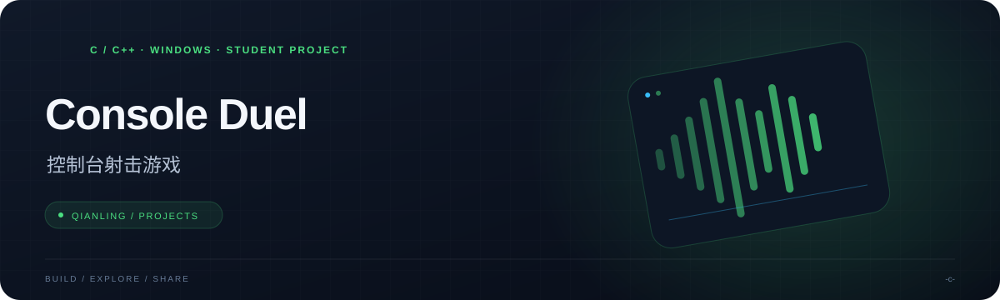

<p align="center"></p>

<h1 align="center">Console Duel · 控制台射击游戏</h1>

<p align="center">在字符画布上移动、转向与发射，体验单人对战和双人同屏。</p>

<p align="center">  </p>

<p align="center"><a href="#快速开始">快速开始</a> &nbsp; · &nbsp; <a href="#玩法与按键">玩法与按键</a> &nbsp; · &nbsp; <a href="#读代码">读代码</a> &nbsp; · &nbsp; <a href="#项目背景">项目背景</a></p>

---

## 项目概览

| 方向 | 内容 |
| --- | --- |
| **单人模式** | 与程序控制的对手交战 |
| **双人模式** | 同一键盘上的本地对战 |
| **学习入口** | 画布、输入、子弹与碰撞逻辑 |

## 快速开始

在 Windows 上安装 Visual Studio 的“使用 C++ 的桌面开发”工作负载，以及源码引用的 EasyX 图形库（`graphics.h`）。

```powershell
git clone https://github.com/QIANLING-0831/-c-.git
cd .\-c-
```

打开 [`gametest/gametest.sln`](gametest/gametest.sln)，选择 x64 配置并生成项目，再在控制台运行。仓库包含历史编译产物，建议自行构建当前源码。

## 玩法与按键

启动菜单提供 **1：单人游戏**、**2：双人游戏**。

| 操作 | 字母键方案 | 数字键方案（双人） |
| --- | --- | --- |
| 上 / 左 / 下 / 右 | W / A / S / D | 8 / 4 / 5 / 6 |
| 逆 / 顺时针转向 | Q / E | 7 / 9 |
| 发射 | 空格 | 0 |

生命值和剩余子弹显示在画布下方；移动、转向与发射规则可在源码中查看。

## 读代码

[`gametest.cpp`](gametest/gametest/gametest.cpp) 集中了字符画布、键盘输入、对手行为、子弹更新和碰撞处理，适合学习控制台实时游戏的基本循环。

## 项目背景

这是作者在大一阶段对已有教程代码的改进：修正部分问题，并增加游戏模式。项目保留早期结构，全局状态与边界处理仍有优化空间。当前依赖 Windows 控制台接口，跨平台运行需要进一步适配。

仓库尚未包含许可证文件，使用或再分发前请与作者确认授权。
